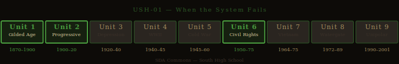

# When the System Fails — Studio Packet

**Studio Code:** USH-01
**Subject Area:** US History — Units 1–2 (Progressive Era) + Unit 6 (Civil Rights)
**Suggested Cycle:** Year 2, Cycle 1
**Duration:** 6 weeks

---

*US History Unit Timeline — highlighted segment(s) indicate this studio's historical period.*

## The Essential Question

**When an institution fails the people it's supposed to serve, what does it take to fix it — and who has to do the work?**

---

## Why This Studio Matters

Upton Sinclair exposed the meatpacking industry in 1906 and got food safety regulation — not the labor reform he actually wanted. Melba Beals walked through a mob to integrate a high school in 1957 because nine students and a federal order forced what a decade of legal victories hadn't. Martin Luther King Jr. wrote a letter from a jail cell in 1963 addressed to white Christian clergy who agreed with him in principle but kept asking for patience.

This studio spans 60 years of American history — the Progressive Era to the Civil Rights Movement — through a single through-line: What does it look like when people force a broken system to change? It builds US.6_12.1 (progressive reform), US.6_12.2 (rights and citizenship), and US.6_12.4 (economics and labor), while developing the full ELA argument-writing and primary-source analysis toolkit.

---

## Active Standards

| Standard | What You're Targeting |
|----------|-----------------------|
| **US.6_12.1 + Units 1–2** | Progressive Era reform movements and the role of exposure journalism |
| **US.6_12.2 + Unit 6** | Civil rights movement: strategies, arguments, and the limits of legal progress |
| **US.6_12.4 + Unit 1** | Labor conditions, economic inequality, and reform |
| **9-10.R.9** | Analyzing argument in primary sources: How does each text construct its case for change? |
| **9-10.W.4** | Argument writing: claim, evidence, counterargument, qualification |
| **9-10.R.8** | Literary elements in memoir: How does Beals' narrative choices construct historical meaning? |

---

## ELA ↔ SS Crosswalk

Every text in this studio was written to change something — which means analyzing the writing (ELA) and analyzing the historical argument (SS) are the same work.

- **MLK, "Letter from Birmingham Jail"** — This is the #1 highest-leverage crosswalk text in the entire library. Analyzing its argument structure for **R.9** and using it as a W.4 mentor text is the same as building **US.6_12.3-4 + Unit 6** evidence about Civil Rights strategy and the argument for urgent nonviolent action. There's a dedicated crosswalk resource: [Letter from Birmingham + W.4 Crosswalk](../../reading-library/crosswalk/letter-birmingham-w4-crosswalk.md). One text, multiple standards, with the ELA and SS questions identical.

- ***The Jungle* (Sinclair)** — Reading it for **R.8** (how does Sinclair use literary narrative — scene, character, detail — to make his argument?) simultaneously builds **US.6_12.5 + Unit 1** evidence about the Progressive Era and the role of muckraking journalism in reform. It's in the [ELA ↔ SS Crosswalk](../../reading-library/crosswalk/crosswalk-ela-ss.md).

- ***Warriors Don't Cry* (Beals)** — Literary analysis of the memoir for **R.8** (how does Beals use personal narrative, detail, and scene to function as historical testimony?) is directly building **US.6_12.2 + Unit 6** evidence about the Civil Rights movement and what nine students had to do in person to accomplish what years of legal victories hadn't.

A single Demo of Learning can satisfy both an ELA and a USH standard if your Studio Contract names both. Talk to Reese in Week 1 if you want to use a crosswalk approach.

See the [ELA ↔ SS Crosswalk](../../reading-library/crosswalk/crosswalk-ela-ss.md) for the full map of how texts serve both subject areas across all studios.

---

## Reading List

| Text | Why It's Here |
|------|---------------|
| [The Jungle — Sinclair](../../reading-library/social-studies/jungle-sinclair.md) | Muckraking journalism as reform tool; Sinclair's own words: "I aimed at the heart and hit the stomach" |
| [Warriors Don't Cry — Beals](../../reading-library/ela/warriors-dont-cry.md) | Civil Rights primary source; memoir as historical testimony; nine children doing what Brown v. Board couldn't |
| [MLK — Letter from Birmingham Jail](../../reading-library/social-studies/mlk-letter-birmingham.md) | The argument for urgent action against the "white moderate"; written from a jail cell to people who agreed with him in principle |
| [Narrative of Frederick Douglass](../../reading-library/social-studies/narrative-frederick-douglass.md) | Optional extension: the 1845 precedent — reform arguments that work by forcing readers to witness |
| [Malala — UN Speech](../../reading-library/social-studies/malala-un-speech.md) | Optional contemporary connection: institutional failure + individual response |

**Required minimum:** Two texts from the core three (Jungle, Warriors, MLK). The studio works best with all three — they're in direct conversation about who has to do the work of reform.

---

## Inquiry Angle Menu

**Trailblazer angles:**
- Sinclair wanted labor reform. He got food safety regulation. Using the text and its historical context, explain why the public responded to the stomach and not the heart. What does this reveal about how reform actually works?
- MLK's Letter is addressed to "My Dear Fellow Clergymen." Why does he choose this audience? What does he know about them? How does writing to them specifically change his argument?

**Maverick angles:**
- Compare Sinclair's strategy (exposure journalism) and Beals' strategy (embodied protest — walking into the mob) as reform tools. What does each one do that the other can't? Which created more lasting change?
- MLK spends most of the Letter responding to criticism from white moderates who *agree with him*. Why is that audience his problem? What does his argument reveal about the difference between agreement in principle and action in practice?
- All three texts describe situations where the law was either inadequate or actively complicit. How does each author argue for change when "follow the law" isn't a solution?

**Phoenix angles:**
- "The people who fix broken systems are almost never the people the system was designed to serve — they're always people who had to fight to be included." Evaluate this claim using evidence from all three texts and at least one additional historical example of your choice.
- The Progressive Era and the Civil Rights Movement both produced major legal change. But Sinclair was disappointed by what his book accomplished, and Beals describes the gap between legal integration and actual safety. What does this pattern reveal about the relationship between legal change and social change?

---

## Six-Week Arc

| Week | Phase | What You're Doing |
|------|-------|------------------|
| **1** | Launch | Read this passage from The Jungle: "I aimed at the public's heart, and by accident I hit it in the stomach." Then read MLK's first paragraph of the Birmingham Letter. What do these two men have in common about how their audience responded to them? Submit your Studio Proposal. |
| **2** | Dig | Deep read your selected texts. For R.9: What is each author's argument for why the system is failing? For whom? Who is the intended audience — and how does that shape the argument? For R.8 (Beals): What narrative choices does she make that an academic history book couldn't? |
| **3** | Build | Draft your deliverable. Your central question: What does it take to force a broken system to change — and who has to do the work? Use specific evidence. |
| **4** | Shape | Peer review and advisor conference. Identify the assumption in your argument that you haven't examined — something you're taking for granted. Revise to either defend it or qualify it. |
| **5** | Finish | Complete demonstration of learning. Polish deliverable. Prepare for exhibition. |
| **6** | Publish | Exhibition. Reflection. Archive. |

---

## Demonstration of Learning Options

| Mode | Prompt for This Studio |
|------|----------------------|
| **1 — Written Assessment** | In 500–700 words: Analyze how one of the three core texts makes its argument for reform. What is the author's claim? Who is their audience? What rhetorical strategies do they use? What is their blind spot? |
| **2 — Extended Writing** | Argument essay (700–1,000 words): Compare two of the three reform strategies (Sinclair's exposure journalism, Beals' embodied protest, MLK's letter to reluctant allies). Which created more lasting change — and by what standard are you measuring "lasting change"? |
| **3 — Verbal Conversation** | Advisor conference: Walk through the essential question using all three texts. For each: What was the system failure? What was the strategy? What changed — and what didn't? |
| **4 — Visual/Creative** | Timeline/comparison exhibit: Map the three reform moments on a visual that shows what changed legally, socially, and economically after each. Annotate: What did the texts themselves make happen, and what required something more? |
| **5 — Multimedia/Performance** | Documentary or recorded presentation: "Who Does the Work of Reform?" — using the three texts to answer the essential question for a general audience. Must demonstrate US.6_12.1+2 and R.9 evidence. |
| **6 — Portfolio Annotation** | Curate prior work and annotate for US.6_12.1+2+4 and R.9+R.8 evidence. Commentary must reference specific text passages and explain your analytical reasoning. |

---

## Deliverable Ideas

1. **"Aimed at the Heart, Hit the Stomach"** — A research essay on Sinclair's *The Jungle*: What did he intend? What happened? What does the gap between intent and effect reveal about how public response to reform arguments works?

2. **"The Letter's Audience"** — A rhetorical analysis of MLK's Letter: Why does he choose white Christian moderates as his audience? Analyze the specific rhetorical strategies he uses for that specific audience. Then: What would the letter look like if it were addressed to a different audience?

3. **"Nine Students"** — A research exhibit or documentary on the Little Rock Nine: Using *Warriors Don't Cry* and secondary sources, examine why it took nine teenagers to force integration that three years of legal victories hadn't accomplished.

4. **"Then and Now"** — A comparative analysis connecting one of the three reform moments to a contemporary institutional failure and reform effort. Use the analytical framework from this studio: What is the system failure? Who is being harmed? What strategies are being used? What is working and what isn't?

5. **"The Reform Playbook"** — A synthesizing argument essay or presentation: Based on the evidence from all three texts, what are the conditions that make reform succeed? What are the conditions that make it fail? Present your findings as a set of evidence-based claims.

---

## Scale Tasks

### 2.0 — Foundation
- Define: muckraker, Progressive Era, civil disobedience, integration, rhetoric, primary source vs. secondary source
- Correctly describe the historical context and argument of each text
- Identify the audience for each text and why the author chose that audience

### 3.0 — Target
- Analyze the rhetorical strategy of at least two texts: claim, evidence, audience, assumptions
- Connect each reform effort to its historical context: What made the strategy effective or ineffective in that specific moment?
- Trace what actually changed as a result of each text or movement — and identify the gap between what the author wanted and what they got

### 4.0 — Transfer
- Construct an argument about what makes reform succeed or fail — using specific evidence from multiple texts and a claim that goes beyond what any single text says
- OR: Apply the reform-strategy framework to a contemporary institutional failure you identify — using the analytical tools from this studio
- OR: Argue whether the people who pay the highest personal cost in reform movements (Beals walking into a mob; MLK writing from jail; Sinclair losing his public platform) are the same people who benefit most from the change

---

## Skinny Recommendations

| If you're struggling with... | Pull this skinny |
|------------------------------|-----------------|
| Reading argumentative primary sources | [R.9 Informational/Argumentative](../../skinnies/ela9/r9-informational-argumentative-skinny.md) |
| Analyzing literary elements in memoir | [R.8 Literary Elements](../../skinnies/ela9/r8-literary-elements-skinny.md) |
| Writing an argument with multiple sources | [W.4 Argument Writing](../../skinnies/ela9/w4-argument-writing-skinny.md) |
| Managing a multi-source research process | [IR.1–5 Research Bundle](../../skinnies/ela9/ir1-5-research-bundle-skinny.md) |
| Leading or participating in Socratic seminar | [C.6 Discussion and Debate](../../skinnies/ela9/c6-discussion-debate-skinny.md) |

---

## Why This Is Relevant Today?

The reform tradition this studio traces — from Progressive Era muckrakers to Civil Rights activists — is still the main model for how people in a democracy try to fix broken institutions. Upton Sinclair's *The Jungle* exposed conditions in meatpacking plants and led directly to the Pure Food and Drug Act. That model (expose the specific harm, build the public case, force legislative response) is what every investigative journalist, nonprofit advocacy organization, and social movement still uses. The Civil Rights Act of 1964 passed because people like Melba Beals put their bodies on the line at Little Rock, and because MLK made an argument so powerful that dismissing it required publicly defending the indefensible. Labor rights, environmental regulation, consumer protection, disability rights, LGBTQ rights — every expansion of rights and every institutional reform in American history used the same basic playbook this studio studies. And every one of those gains is subject to rollback, which is why understanding how they were won matters. If you want to follow the thread into more recent history, [USH-06: When the Rules Don't Apply](ush-06-when-the-rules-dont-apply.md) asks what happens when accountability mechanisms fail.

---

## Exhibition Format

**Suggested format:** Town hall or panel discussion.

Students present their reform analysis to a mixed audience (classmates, advisor, one guest). Format: 5-minute presentation, then 3 questions from the panel. Panel must include at least one question that challenges the student's claim about what "worked."

**What gets scored at exhibition:**
- **C.1** — formal presentation: organized argument, register, handling of challenge questions
- **C.6** — discussion: responding to pushback with evidence; listening to other students' analyses

---

## Sensitive Content Note

*Warriors Don't Cry* contains descriptions of racial violence, harassment, and threats experienced by Melba Beals and the Little Rock Nine. This content is historically accurate and essential to the text — it is not gratuitous, but it is direct. Students who need support processing this content should speak with their advisor before Week 2.

---

## See Also

- [USH Unit 1 — Industrial Revolution and Progressive Era](../../standards/social-studies/us-history/unit-1-industrial.md)
- [USH Unit 6 — Civil Rights](../../standards/social-studies/us-history/unit-6-civil-rights.md)
- [Warriors Don't Cry — Full Entry](../../reading-library/ela/warriors-dont-cry.md)
- [MLK Letter — Full Entry](../../reading-library/social-studies/mlk-letter-birmingham.md)
- [The Jungle — Full Entry](../../reading-library/social-studies/jungle-sinclair.md)
- [ELA ↔ SS Crosswalk](../../reading-library/crosswalk/crosswalk-ela-ss.md)
- [Letter from Birmingham + W.4 Crosswalk](../../reading-library/crosswalk/letter-birmingham-w4-crosswalk.md)

---

*Studio Packet · USH-01 · SDA Commons Wiki · South High School*
