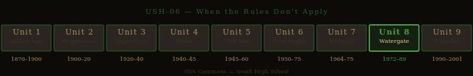

# When the Rules Don't Apply — Studio Packet

**Studio Code:** USH-06
**Subject Area:** US History — Unit 8 (1970s and 1980s: Watergate Through the Reagan Era)
**Suggested Cycle:** Year 2, Cycle 5
**Duration:** 6 weeks

---

*US History Unit Timeline — highlighted segment(s) indicate this studio's historical period.*

## The Essential Question

**When people in power break the rules they're supposed to enforce, what — if anything — holds them accountable?**

---

## Why This Studio Matters

On August 8, 1974, Richard Nixon went on national television and announced he was resigning the presidency. He was the first — and still the only — American president to resign. The reason: the Watergate scandal, in which his campaign operatives had broken into the Democratic National Committee headquarters, and Nixon himself had ordered the cover-up. When the White House tapes made the cover-up undeniable, he resigned rather than face impeachment.

Many Americans took Nixon's resignation as proof that the system worked. The press had investigated. The Senate had held hearings. The Supreme Court had ordered Nixon to release the tapes. A president had been held accountable. Democracy was resilient.

Twelve years later, it happened again. The Reagan administration secretly sold weapons to Iran — in violation of U.S. policy — and used the profits to fund the Contra rebels in Nicaragua — in direct violation of a law Congress had passed. When it came out, the Iran-Contra affair consumed Reagan's second term. Several people were convicted. Reagan himself gave a nationally televised speech saying he hadn't known. But unlike Nixon, Reagan finished his term, left office with a 63% approval rating, and became one of the most revered figures in the modern Republican Party.

This studio asks why one president was removed and another wasn't — and what that difference reveals about how accountability actually works in a democracy. *The Handmaid's Tale* and Orwell's *Politics and the English Language* provide the literary tools for understanding how language is used to evade accountability and how societies slide toward the elimination of it.

---

## Active Standards

| Standard | What You're Targeting |
|----------|-----------------------|
| **US.6_12.1 + Unit 8** | Primary and secondary sources: analyze Nixon's resignation speech and Oliver North's Iran-Contra emails for what is claimed, what is admitted, and what is concealed |
| **US.6_12.5 + Unit 8** | Significant contributions: Nixon (Watergate, EPA, China, détente), Reagan (Reaganomics, Cold War endgame, Iran-Contra), Carter (energy crisis, "malaise"), the constitutional significance of the Watergate accountability process |
| **US.6_12.4 + Unit 8** | Change over time: how the definition of accountability changed from Watergate (president resigns) to Iran-Contra (convictions overturned, president finishes term with high approval) |
| **9-10.R.9** | Analyzing argument in political documents: What do Nixon and Reagan claim? What do the documents (tapes, emails, Iran-Contra testimony) reveal? How does Orwell's framework help analyze the language? |
| **9-10.W.4** | Argument writing: Does Watergate prove the American system of accountability works — or does Iran-Contra prove it doesn't? |
| **IR.1–5** | Research bundle: active every studio |

---

## ELA ↔ SS Crosswalk

Every text in this studio connects ELA and SS standards simultaneously:

- ***The Handmaid's Tale* (Atwood)** — When you analyze it for **R.8** (how Atwood builds her dystopia through character, setting, and narrative structure), you're also building **US.6_12.5 + Unit 8** evidence — because the novel is a direct cultural response to the Reagan era's political climate and is itself a primary artifact of that period. A literary analysis that asks *what is Atwood warning about, and why did she write this in 1985?* is both an ELA and a Social Studies argument.

- **"Politics and the English Language" (Orwell)** — Applying Orwell's essay to Nixon's or Reagan's speeches for **R.9** simultaneously satisfies **US.6_12.1 + Unit 8** (primary source analysis). The essay is an analytical tool and the speeches are the primary sources — using both together in one Demo addresses both standards at once. It appears in the [ELA ↔ SS Crosswalk](../../reading-library/crosswalk/crosswalk-ela-ss.md) as a high-leverage dual-use text.

- ***1984* (Orwell, extension)** — If you use *1984* as your literary lens, **R.8** analysis connects to **WH.6_12.2-3 + Era 4** AND **US.6_12.1 + Unit 8** — it bridges World History and US History. Students who analyzed *1984* in [USH-02](ush-02-literature-of-fear.md) or [USH-05](ush-05-what-the-government-didnt-say.md) should go deeper here rather than repeating prior analysis.

One Demo of Learning can satisfy both an ELA and an SS standard if your Studio Contract names both. See the [ELA ↔ SS Crosswalk](../../reading-library/crosswalk/crosswalk-ela-ss.md) for the full map.

---

## Reading List

| Text | Why It's Here |
|------|---------------|
| [The Handmaid's Tale — Atwood](../../reading-library/ela/handmaids-tale-atwood.md) | Published in 1985, at the height of the Reagan era's political and cultural backlash against feminism and social change, Atwood's novel depicts a theocratic regime that rose to power by exploiting a crisis and dismantling accountability systems one at a time. Gilead doesn't announce itself — it uses existing structures and then removes the safeguards. A literary lens on how accountability systems fail. |
| [Politics and the English Language — Orwell](../../reading-library/ela/orwell-politics-language.md) | Orwell's 1946 essay is the essential analytical tool for this studio. Nixon's resignation speech, Reagan's Iran-Contra denial, Oliver North's congressional testimony — all of them are textbook examples of what Orwell calls "political language designed to make lies sound truthful." Students apply the essay's framework directly to primary sources. |
| [1984 — Orwell](../../reading-library/ela/orwell-1984.md) | Optional extension: Orwell's surveillance state and the concept of "doublethink" provide additional literary framework for understanding how political systems manage accountability — or eliminate it. |

**Required minimum:** *The Handmaid's Tale* (primary literary text) and *Politics and the English Language* (short essay — everyone reads it). *1984* is for students extending into a deeper Orwellian comparison.

---

## Inquiry Angle Menu

**Trailblazer angles:**
- Nixon gave a nationally televised resignation speech on August 8, 1974. He said he was leaving "for the good of the Nation" and that he had "always tried to do what is best for the Nation." He never directly admitted to ordering the cover-up. Using Orwell's "Politics and the English Language," analyze the speech: What does Nixon say? What does he avoid saying? What does Orwell's framework reveal about how the speech works?
- Gilead, in *The Handmaid's Tale*, didn't replace democracy overnight. Atwood describes a gradual process: freeze bank accounts, eliminate certain rights, replace one institution at a time. Using the novel, explain what Atwood is arguing about how authoritarian systems rise — and what warning signs a democratic society should be watching for.

**Maverick angles:**
- Nixon resigned over a cover-up. Reagan's administration committed the same basic offense — illegal covert operations and a cover-up — and Reagan finished his term with a 63% approval rating. Using the historical record, argue: What was different between Watergate and Iran-Contra that produced such different outcomes? What does the difference reveal about how accountability actually works?
- Offred, the narrator of *The Handmaid's Tale*, says at one point: "We lived, as usual, by ignoring. Ignoring isn't the same as ignorance, you have to work at it." Apply this idea to the American public's relationship with Watergate and Iran-Contra. In what ways did the public "work at ignoring" what was being done in its name?
- Oliver North testified before Congress in full military uniform, with his medals, during the Iran-Contra hearings. He became a hero to many conservatives. Using his congressional testimony as a primary source and Orwell's framework, analyze how North constructed his public persona — what he said, how he said it, and why it worked.

**Phoenix angles:**
- The Watergate tapes exist because Nixon recorded every conversation in the Oval Office. The tapes that proved the cover-up were the same tapes Nixon refused to release — and which the Supreme Court ordered him to hand over. Construct an argument about what the Watergate accountability process reveals about the conditions required for democratic accountability to function: What institutions had to work? What would have happened if any one of them had failed?
- *The Handmaid's Tale* is a novel about what happens after accountability fails completely. Orwell's essay analyzes the language that makes accountability failure possible. Nixon's resignation and Iran-Contra are two real-world data points about how the American system handles accountability. Using all four sources, construct an argument about what prevents democracies from sliding toward the world Atwood describes — and what the weaknesses in that prevention system are.

---

## Six-Week Arc

| Week | Phase | What You're Doing |
|------|-------|------------------|
| **1** | Launch | Read Nixon's resignation speech (August 8, 1974) — just the first three paragraphs. Then read Orwell: *"Political language is designed to make lies sound truthful and murder respectable, and to give an appearance of solidity to pure wind."* Does Nixon's speech fit Orwell's description? What does that tell you about the studio's essential question? Submit your Studio Contract. |
| **2** | Dig | Deep read your primary text. For *The Handmaid's Tale* (R.8): How does Atwood structure her dystopia? What mechanisms does Gilead use to eliminate accountability — and what did those mechanisms replace? For SS: Research the Watergate timeline and the Iran-Contra affair in parallel. What did each administration do? What mechanisms exposed it? What consequences followed? |
| **3** | Build | Draft your deliverable. Your central question: What holds people in power accountable — and what happens when those mechanisms fail? Use Orwell, Atwood, and the historical record together. |
| **4** | Shape | Peer review and advisor conference. The key challenge: Are you applying your standard consistently? If you're arguing Nixon's accountability proves the system works, you have to account for Iran-Contra. If you're arguing Iran-Contra proves it doesn't, you have to account for Nixon's resignation. Find the tension and argue through it. |
| **5** | Finish | Complete demonstration of learning. Polish deliverable. Prepare for exhibition. |
| **6** | Publish | Exhibition. Reflection. Archive. |

---

## Demonstration of Learning Options

| Mode | Prompt for This Studio |
|------|----------------------|
| **1 — Written Assessment** | In 500–700 words: Apply Orwell's "Politics and the English Language" framework to Nixon's resignation speech OR Reagan's Iran-Contra address (March 4, 1987). What does the speech claim? What does it avoid? What does it ask the audience to do with the gap? |
| **2 — Extended Writing** | Argument essay (700–1,000 words): Does Watergate prove the American system of democratic accountability works, or does Iran-Contra prove it doesn't? Take a clear position, use specific evidence from both cases, and engage honestly with the counterargument. |
| **3 — Verbal Conversation** | Advisor conference: Walk through the comparison. What did Nixon do? What mechanisms exposed it? What happened to him? What did the Reagan administration do? What happened to them? What does the comparison reveal about democratic accountability? How does *The Handmaid's Tale* illuminate the long-term risks when those mechanisms fail? |
| **4 — Visual/Creative** | Comparison exhibit: Map Watergate and Iran-Contra in parallel — what was the offense, what was the cover-up, what mechanism exposed it, what consequences followed. Annotate: What did *The Handmaid's Tale* add to your understanding of what's at stake when those mechanisms fail? |
| **5 — Multimedia/Performance** | Documentary or recorded presentation: "When the Rules Don't Apply" — using Watergate, Iran-Contra, and Atwood's novel to explain to a general audience what democratic accountability looks like when it works, what it looks like when it doesn't, and what's at stake. Must demonstrate US.6_12.1+4 and R.9 evidence. |
| **6 — Portfolio Annotation** | Curate prior work and annotate for US.6_12.1+5 and R.9+W.4 evidence. Commentary must use proficiency scale language and connect your work to the studio's essential question about who holds power accountable. |

---

## Deliverable Ideas

1. **"The Speech He Gave"** — A primary source analysis of Nixon's resignation speech: What does Nixon admit? What does he deny? What does he ask the public to do? Apply Orwell's framework to the specific language. What does the speech reveal about how politicians use language to manage accountability?

2. **"Two Scandals, One Country"** — An argument essay comparing Watergate and Iran-Contra: Why did one end a presidency and the other didn't? What does the difference reveal about the conditions required for democratic accountability to function?

3. **"How Gilead Got There"** — A literary analysis of *The Handmaid's Tale*: How does Atwood depict the gradual dismantling of accountability? What mechanisms does Gilead replace or eliminate? What is Atwood warning about — and how specific is her warning to a democratic society?

4. **"Oliver North in Uniform"** — A primary source analysis of North's Iran-Contra congressional testimony: How did North construct his public defense? What did he admit, what did he deny, what did he deflect? Why did his appearance resonate with many Americans? Apply Orwell's framework to the testimony.

5. **"The Mechanisms That Held"** — A research essay: In Watergate, what specific institutions and individuals held Nixon accountable? The Senate Select Committee, the special prosecutor, the Supreme Court (8-0 vote to release the tapes), the press (*Washington Post*), the House Judiciary Committee. Analyze which mechanism was most essential — and what would have happened if it had failed.

---

## Scale Tasks

### 2.0 — Foundation
- Define: Watergate, cover-up, impeachment, Iran-Contra, Reaganomics, stagflation, détente, theocracy (from *The Handmaid's Tale*), doublespeak
- Correctly summarize the plot and central conflict of *The Handmaid's Tale*
- Describe what happened in Watergate and Iran-Contra: what the offense was, how it was discovered, and what the consequences were
- Identify Orwell's main argument in "Politics and the English Language"

### 3.0 — Target
- Analyze how Atwood depicts the mechanisms of accountability failure in *The Handmaid's Tale* — what specific institutions and rights does Gilead eliminate, and in what order?
- Apply Orwell's framework to at least one primary source from the Nixon or Reagan era: identify specific language strategies and explain what they do
- Build an argument about accountability in American democracy using both Watergate and Iran-Contra — with a clear claim, evidence from both cases, and honest engagement with the tension between them
- Explain what changed (and what didn't) in how accountability worked between Watergate and Iran-Contra

### 4.0 — Transfer
- OR: Build a framework for what needs to be in place for accountability to actually work in a democracy — based on Watergate, Iran-Contra, and *The Handmaid's Tale* — and test it against at least one more recent example
- OR: Argue whether the American system of checks and balances has been strengthened or weakened since Watergate — using specific evidence from the decades since
- OR: Use Atwood's Gilead as a model and Orwell's "Politics and the English Language" as an analytical tool to analyze how a contemporary political movement or government uses language in ways Orwell would recognize

---

## Skinny Recommendations

| If you're struggling with... | Pull this skinny |
|------------------------------|-----------------|
| Analyzing argument in political speeches and documents | [R.9 Informational/Argumentative](../../skinnies/ela9/r9-informational-argumentative-skinny.md) |
| Analyzing literary elements in dystopian fiction | [R.8 Literary Elements](../../skinnies/ela9/r8-literary-elements-skinny.md) |
| Writing an argument that handles a genuine tension | [W.4 Argument Writing](../../skinnies/ela9/w4-argument-writing-skinny.md) |
| Managing research across multiple sources | [IR.1–5 Research Bundle](../../skinnies/ela9/ir1-5-research-bundle-skinny.md) |
| Presenting analysis to a live audience | [C.1 Formal Presentation](../../skinnies/ela9/c1-formal-presentation-skinny.md) |

---

## Why This Is Relevant Today?

Watergate established that no one — not even the president — is above the law. Iran-Contra suggested that established accountability mechanisms can be worked around. The decades since have tested the Watergate principle repeatedly, and the results are mixed. The question of whether democratic accountability systems are strong enough to hold powerful people responsible is more contested now than it has been since Nixon resigned. Margaret Atwood wrote *The Handmaid's Tale* in 1985 as a warning about how democracies slide into authoritarianism — not through sudden coups but through gradual erosion, one institution at a time. The novel has never been out of print, and its sales spike every time democratic institutions come under pressure. Orwell's "Politics and the English Language" is not an essay about 1946 — it's a diagnostic tool for analyzing political speech in any era. The pattern it describes (vague language used to make unacceptable things acceptable, euphemisms that allow politicians to claim they didn't say what they clearly meant) is the dominant mode of political communication today. If you want to connect this studio to the present, the accountability questions it raises are the same ones asked about every major political scandal since Watergate.

---

## Exhibition Format

**Suggested format:** Town hall or panel presentation.

Students present their analysis of the studio's central question to an audience that includes advisor and at least one outside guest (parent, administrator, or community member who lived through this era). Each student gets 5 minutes, then takes 2 questions. The final 15 minutes is an open class discussion: Do you think the American system of accountability is stronger or weaker than it was in 1974? Why?

**What gets scored at exhibition:**
- **C.1** — Presenting a complex argument about accountability clearly and with evidence; handling the format professionally
- **C.6** — Engaging with challenge questions about your reasoning; responding to counterarguments from the audience

---

## See Also

- [USH Unit 8 — 1970s and 1980s](../../standards/social-studies/us-history/unit-8-1970s-1980s.md)
- [The Handmaid's Tale — Full Entry](../../reading-library/ela/handmaids-tale-atwood.md)
- [Politics and the English Language — Full Entry](../../reading-library/ela/orwell-politics-language.md)
- [1984 — Full Entry](../../reading-library/ela/orwell-1984.md)
- [USH-05 — What the Government Didn't Say](ush-05-what-the-government-didnt-say.md) *(Vietnam / Pentagon Papers — the preceding studio)*
- [USH-07 — The Unipolar Moment](ush-07-unipolar-moment.md) *(Post-Cold War — the following studio)*
- [ELA ↔ SS Crosswalk](../../reading-library/crosswalk/crosswalk-ela-ss.md)

---

*Studio Packet · USH-06 · SDA Commons Wiki · South High School*
