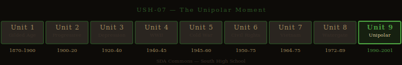

# The Unipolar Moment — Studio Packet

**Studio Code:** USH-07
**Subject Area:** US History — Unit 9 (1990s and Early 2000s)
**Suggested Cycle:** Year 2, Cycle 6
**Duration:** 6 weeks

---

*US History Unit Timeline — highlighted segment(s) indicate this studio's historical period.*

## The Essential Question

**After winning the Cold War, the United States had more power than any nation in history. What did it do with that power — and who decided?**

---

## Why This Studio Matters

In 1991, the Soviet Union collapsed. The Cold War was over, and the United States had won. Commentators called it the "unipolar moment" — for the first time in modern history, there was only one superpower. The question was what to do with that position.

The 1990s answer, roughly: expand NATO, negotiate free trade agreements, watch genocide unfold in Rwanda and Bosnia without intervening militarily, and enjoy the longest economic expansion in American history. Then on September 11, 2001, 2,977 people were killed in coordinated attacks on the World Trade Center and the Pentagon. The United States invaded Afghanistan within weeks. Two years later, it invaded Iraq — based on intelligence about weapons of mass destruction that didn't exist — beginning a war whose consequences are still unfolding.

This studio asks a deceptively simple question: What does the most powerful nation in history owe the world — and what does it owe itself? Khaled Hosseini's *The Kite Runner* and Marjane Satrapi's *Persepolis* are both set in countries the United States had policies about — Afghanistan and Iran — and both tell those stories from the inside, at human scale. Reading them doesn't tell students what U.S. foreign policy should have been. It tells them what it costs to live inside a country that other, more powerful countries have decisions about. That perspective is essential for understanding what a superpower's choices actually do.

---

## Active Standards

| Standard | What You're Targeting |
|----------|-----------------------|
| **US.6_12.6 + Unit 9** | Past to present: the War on Terror's ongoing consequences for civil liberties, foreign policy, and national identity — connecting 9/11 to contemporary debates about surveillance, immigration, and military intervention |
| **US.6_12.2 + Unit 9** | Multiple perspectives: American perspective on 9/11 vs. Afghan or Iraqi perspective on the U.S. invasions; the debate about NAFTA and globalization; civil liberties vs. security after the PATRIOT Act |
| **US.6_12.3 + Unit 9** | Cause and effect: 9/11 → PATRIOT Act → Afghanistan → Iraq (WMDs) → destabilization of the region → long-term consequences still playing out |
| **9-10.R.8** | Literary elements in memoir and graphic memoir: how Hosseini and Satrapi use personal narrative to provide human-scale perspective on political and historical events their countries' governments (and the U.S.) made abstract |
| **9-10.W.4** | Argument writing: Was the U.S. invasion of Iraq a justified use of American power — and by what standard do you measure that? Claim, evidence, counterargument, qualification |
| **IR.1–5** | Research bundle: active every studio |

---

## ELA ↔ SS Crosswalk

Every text in this studio does double duty across ELA and Social Studies:

- ***The Kite Runner* (Hosseini)** — Literary analysis for **R.8** (how Hosseini uses personal narrative, character, and setting to provide human-scale perspective on political history) simultaneously satisfies **US.6_12.2 + Unit 9** (multiple perspectives — specifically, the Afghan perspective on events American foreign policy treated as abstractions). One Demo of Learning, two standards addressed.

- ***Persepolis* (Satrapi)** — R.8 analysis (graphic memoir format: how Satrapi uses panel composition, visual language, and personal narrative as political argument) connects directly to **US.6_12.2 + Unit 9** (multiple perspectives — the Iranian perspective on the Islamic Revolution and U.S.-Iran relations). If you analyzed *Persepolis* in [WH-05: The Cost of War](wh-05-the-cost-of-war.md), this studio is your chance to go deeper with a USH angle.

- **Malala's UN Speech** — Reading it for **R.9** (argument structure, audience, rhetorical strategies) simultaneously satisfies **US.6_12.6 + Unit 9** (connecting past to present: the ongoing consequences of American foreign policy in the Middle East/South Asia). Short text, double standard.

A single Demo of Learning can satisfy both an ELA and an SS standard if your Studio Contract names both and your analysis addresses both dimensions. Talk to Reese in Week 1 if you want to use a crosswalk approach.

See the [ELA ↔ SS Crosswalk](../../reading-library/crosswalk/crosswalk-ela-ss.md) for the full map of how texts serve both subject areas across all studios.

---

## Reading List

| Text | Why It's Here |
|------|---------------|
| [The Kite Runner — Hosseini](../../reading-library/ela/kite-runner-hosseini.md) | Hosseini's 2003 novel follows an Afghan family from Kabul before the Soviet invasion through Taliban rule and the aftermath of 9/11. It gives students human-scale context for a country the United States invaded — not as a political argument but as a story about what life actually looked like in Afghanistan before, during, and after American involvement. |
| [Persepolis — Satrapi](../../reading-library/ela/persepolis-satrapi.md) | Satrapi's graphic memoir of growing up in Iran during the Islamic Revolution provides the same function for a country the U.S. had antagonistic policies toward throughout the Cold War and after. Iran is often presented as an abstraction in American foreign policy debates — Persepolis makes it a place where people lived their actual lives. |
| [Malala's UN Speech](../../reading-library/social-studies/malala-un-speech.md) | Yousafzai's 2013 speech to the United Nations — given after she survived being shot by the Taliban — is a primary source from a contemporary figure who grew up in a country where American foreign policy decisions had direct, personal consequences. It's also a model of argument: a young woman making a case for education to the most powerful international body in the world. |

**Required minimum:** Choose *The Kite Runner* or *Persepolis* as your primary literary text. *Malala's UN Speech* is short and everyone should read it — it grounds the literary texts in a contemporary voice. Students doing a comparative angle may use both novels.

---

## Inquiry Angle Menu

**Trailblazer angles:**
- Amir, the narrator of *The Kite Runner*, spends the novel trying to atone for something he did as a child. But the novel is also about Afghanistan — what it looked like before the Soviet invasion, what the Taliban did to it, and what remained. Using the novel, explain what Hosseini shows you about Afghanistan that U.S. news coverage of the 2001 invasion couldn't tell you. What does the personal scale add?
- George W. Bush gave a speech on May 1, 2003, on the deck of the USS *Abraham Lincoln*, beneath a banner reading "Mission Accomplished." The Iraq War continued for another 8 years. Using that speech as a primary source, apply Orwell's "Politics and the English Language": What does the speech claim? What does it assume? What does it not say?

**Maverick angles:**
- The United States invaded Iraq in 2003 based on the claim that Saddam Hussein possessed weapons of mass destruction. No WMDs were found. Using the intelligence documents that have since been declassified and the Bush administration's public statements before the invasion, argue: What did the government know, what did it claim to know, and what does the gap between those two things reveal?
- Compare Satrapi's depiction of growing up in Iran during the Islamic Revolution (*Persepolis*) with American foreign policy toward Iran during the same period (1979 hostage crisis, Iran-Contra, sanctions). What does reading *Persepolis* add to your understanding of the U.S.-Iran relationship — and what does it challenge about the way that relationship is usually presented to Americans?
- Malala Yousafzai was shot by the Taliban in 2012 for advocating for girls' education. Her speech to the UN in 2013 — given less than a year later — became one of the most-watched speeches in UN history. Analyze it as an argument: What is her claim? Who is her audience? What rhetorical strategies does she use? Why does her specific position (survivor, teenager, girl from Pakistan) make her argument more powerful than it would be coming from anyone else?

**Phoenix angles:**
- The United States watched the Rwandan genocide (1994, approximately 800,000 killed in 100 days) and the Bosnian genocide (1995, approximately 8,000 killed at Srebrenica) without military intervention, while simultaneously maintaining the military infrastructure that would later be used to invade Afghanistan and Iraq. Using these cases, construct an argument about what the most powerful nation in history owes the world when it witnesses genocide — and what the consistent application of that standard would require.
- Both *The Kite Runner* and *Persepolis* are personal narratives from countries that American foreign policy treated as abstractions. Construct an argument about what changes when you understand a country's people before you evaluate a foreign policy decision about that country — and what that requires of citizens in a democracy who are asked to support or oppose military action.

---

## Six-Week Arc

| Week | Phase | What You're Doing |
|------|-------|------------------|
| **1** | Launch | Read this excerpt from Malala's UN speech: *"One child, one teacher, one book, one pen can change the world."* Then read the first paragraph of the 2002 Authorization for Use of Military Force Against Iraq: *"The President is authorized to use the Armed Forces of the United States as he determines to be necessary and appropriate..."* What do these two documents, addressed to the same world in the same decade, say about who gets to decide what changes the world? Submit your Studio Contract. |
| **2** | Dig | Deep read your chosen literary text for R.8: In *The Kite Runner*, how does Hosseini use Amir's personal story to show you what Afghanistan was and what it became? In *Persepolis*, how does Satrapi's graphic format — the visual language of the panels — function as argument and testimony? For SS: Research the 9/11 → Iraq War cause-and-effect chain. What did the Bush administration claim? What has since been established? |
| **3** | Build | Draft your deliverable. Your central question: What did the United States do with its superpower status in the 1990s and 2000s — and who paid the price of those decisions? Use the literary text's human-scale perspective alongside the historical record. |
| **4** | Shape | Peer review and advisor conference. Key challenge: Is your argument about U.S. foreign policy based on evidence — or on what you already believed before you started? Make sure you've engaged with the strongest version of the case for U.S. intervention (both in Afghanistan and Iraq) before you evaluate it. |
| **5** | Finish | Complete demonstration of learning. Polish deliverable. Prepare for exhibition. |
| **6** | Publish | Exhibition. Reflection. Archive. |

---

## Demonstration of Learning Options

| Mode | Prompt for This Studio |
|------|----------------------|
| **1 — Written Assessment** | In 500–700 words: Analyze how Hosseini (*The Kite Runner*) or Satrapi (*Persepolis*) uses personal narrative to provide perspective on a country that U.S. foreign policy treated as an abstraction. What does the personal scale add that policy documents and news coverage couldn't? |
| **2 — Extended Writing** | Argument essay (700–1,000 words): Was the U.S. invasion of Iraq in 2003 a justified use of American power? Use specific historical evidence: the WMD claims, the congressional authorization, what was known at the time, and what the consequences have been. Take a clear position and engage with the strongest counterargument. |
| **3 — Verbal Conversation** | Advisor conference: Walk through the studio's central question. What did the United States do with its superpower status in the 1990s? What happened on 9/11, and how did the U.S. respond? What does *The Kite Runner* or *Persepolis* add to your understanding of what those decisions meant for people living in Afghanistan or Iran? |
| **4 — Visual/Creative** | Timeline exhibit: Map U.S. foreign policy decisions from 1991–2010 alongside their consequences — for the countries involved and for American civil liberties (PATRIOT Act, surveillance). Annotate: For each decision, who made it, what was the stated justification, and who paid? |
| **5 — Multimedia/Performance** | Documentary or recorded presentation: "The Unipolar Moment" — using *The Kite Runner* or *Persepolis*, Malala's speech, and the historical record to tell the story of American power in the 1990s and 2000s for a general audience. Must demonstrate US.6_12.6+2 and R.8 evidence. |
| **6 — Portfolio Annotation** | Curate prior work and annotate for US.6_12.6+3 and R.8+W.4 evidence. Commentary must use proficiency scale language and connect your prior work to the studio's essential question about what a superpower owes the world. |

---

## Deliverable Ideas

1. **"What the Kite Runner Taught Me About Afghanistan"** — A literary analysis essay: How does Hosseini use personal narrative to complicate the American understanding of Afghanistan? What does the novel show you that news coverage of the 2001 invasion couldn't? What does understanding a country's people change about how you evaluate foreign policy decisions about that country?

2. **"The WMDs That Weren't There"** — An argument essay: Using the intelligence documents and Bush administration statements available before the Iraq invasion and what has since been established, argue whether the invasion of Iraq was a justified use of American power — and what the standard for "justified" should be.

3. **"Malala's Argument"** — A rhetorical analysis of Malala's UN speech: What is her claim? Who is her audience? What rhetorical strategies does she use? Why does her specific position — survivor, teenager, Pakistani girl — make her argument more powerful? What does analyzing her speech reveal about what makes an argument persuasive in a global political context?

4. **"Two Countries, Two Stories"** — A comparative literary analysis: Compare how Hosseini (*The Kite Runner*) and Satrapi (*Persepolis*) use personal narrative as a form of political argument about their home countries. What is each author trying to make their reader understand? How does the choice of form — novel vs. graphic memoir — shape what each one can do?

5. **"Then and Now"** — A research analysis: Connect the decisions made in the War on Terror to their long-term consequences still playing out today. Choose one thread (civil liberties and surveillance, the Iraq War's consequences for regional stability, the Afghanistan withdrawal) and trace it from its 9/11-era origins to the present. What does the long-term view reveal about how the United States used its power in the unipolar moment?

---

## Scale Tasks

### 2.0 — Foundation
- Define: unipolar moment, 9/11, War on Terror, PATRIOT Act, weapons of mass destruction, Taliban, Al-Qaeda, NAFTA, globalization, graphic memoir
- Correctly summarize the plot and major characters of *The Kite Runner* or *Persepolis*
- Describe the cause-and-effect chain from 9/11 to the Afghanistan invasion to the Iraq invasion
- Identify Malala Yousafzai, explain who she is and what she argued in her UN speech

### 3.0 — Target
- Analyze how Hosseini or Satrapi uses literary/graphic memoir elements to create human-scale perspective on political events — name specific techniques and explain what they do
- Construct an argument about the Iraq War or another U.S. foreign policy decision: clear claim, specific historical evidence, honest engagement with the counterargument
- Explain the cause-and-effect chain from 9/11 through the long-term consequences of the War on Terror, connecting specific decisions to specific outcomes
- Connect the past to the present: identify at least one current political debate that traces directly to decisions made in the 1990s–2000s

### 4.0 — Transfer
- OR: Build a framework for when a superpower's use of military force is justified — test it against Afghanistan (2001), Iraq (2003), and at least one case where the U.S. chose not to intervene (Rwanda, Bosnia), and argue whether your framework produces consistent results
- OR: Argue whether the United States' response to 9/11 represents the responsible use of its superpower status, the irresponsible use of it, or something more complicated than either — using specific evidence and engaging with the strongest version of each position
- OR: Use *The Kite Runner* or *Persepolis* to argue that literature can tell a citizen something about foreign policy that journalism and government documents cannot — and identify what that is and why it matters

---

## Skinny Recommendations

| If you're struggling with... | Pull this skinny |
|------------------------------|-----------------|
| Analyzing literary elements in memoir and graphic memoir | [R.8 Literary Elements](../../skinnies/ela9/r8-literary-elements-skinny.md) |
| Writing an argument about a complex foreign policy question | [W.4 Argument Writing](../../skinnies/ela9/w4-argument-writing-skinny.md) |
| Analyzing argument in political speeches and documents | [R.9 Informational/Argumentative](../../skinnies/ela9/r9-informational-argumentative-skinny.md) |
| Finding and evaluating sources for a current events connection | [IR.1–5 Research Bundle](../../skinnies/ela9/ir1-5-research-bundle-skinny.md) |
| Presenting to a live audience | [C.1 Formal Presentation](../../skinnies/ela9/c1-formal-presentation-skinny.md) |

---

## Why This Is Relevant Today?

The "unipolar moment" is over. China has become a peer competitor. Russia has invaded Ukraine. The U.S. is redefining its alliances, renegotiating its trade relationships, and debating how much it owes the countries it has been involved with militarily. The wars in Afghanistan and Iraq — begun in response to 9/11 — formally ended, but their consequences didn't. The Afghan government the U.S. spent 20 years and trillions of dollars building collapsed in days when U.S. troops withdrew. The Iraq War produced the conditions that created ISIS. The PATRIOT Act surveillance infrastructure built after 9/11 is still operating. And the question *The Kite Runner* and *Persepolis* ask — what does it actually mean to live in a country that a more powerful country has made decisions about? — is the perspective most Americans never have to consider, and that residents of dozens of countries cannot escape. Understanding the unipolar moment is not just understanding recent history — it's understanding the world you're inheriting, the alliances that are fraying, the resentments that are accumulating, and the consequences of decisions that were made before most of this year's students were born. See [USH-05: What the Government Didn't Say](ush-05-what-the-government-didnt-say.md) for the Vietnam parallel — the last time the U.S. fought a war it couldn't win.

---

## Exhibition Format

**Suggested format:** Community showcase or documentary screening.

Students present to an expanded audience — parents, community members, and other South High students — because this studio's question (what does American power owe the world?) is one the audience has real stakes in. Format: Students display or screen their deliverables. Each student has 5 minutes for presentation and 3 minutes for questions. The exhibition closes with a full group discussion: What did you learn from this year in SDA?

**What gets scored at exhibition:**
- **C.1** — Presenting a complex argument about foreign policy to a community audience; using evidence clearly; handling the format professionally
- **C.6** — Responding to questions about your reasoning; engaging with audience members who have different perspectives on U.S. foreign policy; defending your position with evidence

---

## See Also

- [USH Unit 9 — 1990s and Early 2000s](../../standards/social-studies/us-history/unit-9-1990s-2000s.md)
- [The Kite Runner — Full Entry](../../reading-library/ela/kite-runner-hosseini.md)
- [Persepolis — Full Entry](../../reading-library/ela/persepolis-satrapi.md)
- [Malala's UN Speech — Full Entry](../../reading-library/social-studies/malala-un-speech.md)
- [USH-06 — When the Rules Don't Apply](ush-06-when-the-rules-dont-apply.md) *(Reagan era — the preceding studio)*
- [USH-01 — When the System Fails](ush-01-when-the-system-fails.md) *(Year 2 opening studio — reform thread)*
- [ELA ↔ SS Crosswalk](../../reading-library/crosswalk/crosswalk-ela-ss.md)
- [WH-05 — The Cost of War](wh-05-the-cost-of-war.md) *(Persepolis also appears here — WH Era 4 angle)*

---

*Studio Packet · USH-07 · SDA Commons Wiki · South High School*
