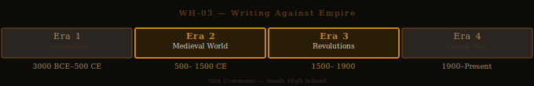

# Writing Against Empire — Studio Packet

**Studio Code:** WH-03
**Subject Area:** World History — Era 2–3 (Colonialism and Imperialism)
**Suggested Cycle:** Year 1, Cycle 4
**Duration:** 6 weeks

---

*World History Era Timeline — highlighted segment(s) indicate this studio's historical period.*

## The Essential Question

**When a powerful system is doing harm, what does it take to challenge it — and what does it cost?**

---

## Why This Studio Matters

Las Casas was a Spanish priest who condemned the conquest. Kipling was a poet who celebrated empire; H.T. Johnson was the Black minister who responded to him in the same meter. Frederick Douglass was a man who had been enslaved, who learned to read in secret, and who risked his freedom to tell the world what slavery was. Three different centuries, three different forms of empire, three different costs — and all of them writing.

This studio examines what "writing against power" looks like, sounds like, and costs. It builds the R.9 (argument analysis) and IR.4 (source evaluation) skills that every WH studio depends on, while developing the WH.6_12.4 and WH.6_12.5 foundation for understanding colonialism and imperialism — the two systems that shaped the modern world more than almost anything else.

---

## Active Standards

| Standard | What You're Targeting |
|----------|-----------------------|
| **WH.6_12.4 + Era 2–3** | Cultural contact, exchange, and the mechanisms of colonial control |
| **WH.6_12.5 + Era 2–3** | Causes and effects of colonialism and imperialism |
| **9-10.R.9** | Analyzing argument — rhetorical strategy, audience, purpose, assumptions |
| **9-10.IR.4** | Source evaluation — credibility, perspective, bias, what a source sees and misses |
| **9-10.W.4** | Argument writing: claim, evidence, counterargument, qualification |

---

## ELA ↔ SS Crosswalk

Every text in this studio is a rhetorical act — someone writing to challenge a powerful system. Analyzing *how* they make that argument (ELA: R.9) is the same as analyzing *what* they were challenging and why (SS: WH.6_12.4-5).

- **Las Casas, *A Short Account of the Destruction of the Indies*** — Reading it for **R.9** (how does Las Casas construct his argument for stopping the conquest? who is his audience? what does he include and leave out?) simultaneously builds **WH.6_12.4-5 + Era 2–3** evidence (colonialism, the role of the Church, how indigenous peoples were treated and described). One text, two standards.

- **Kipling, "The White Man's Burden"** — Analyzing Kipling's argument for **R.9** (what is he actually arguing? what assumptions does he make that he doesn't state?) is directly building **WH.6_12.4-5 + Era 3** evidence about the ideology of imperialism. The ELA question *IS* the SS question: What argument is imperialism making about itself?

- **Narrative of Frederick Douglass** (if used) — R.8 literary analysis (how does Douglass use memoir, narrative, and scene to make his argument?) connects directly to **WH.6_12.4-5 + Era 3** (resistance to colonial/slavery systems; the abolitionist movement as a counter-argument to imperial ideology).

A single Demo of Learning can satisfy both an ELA and a WH standard if your Studio Contract names both. See the [ELA ↔ SS Crosswalk](../../reading-library/crosswalk/crosswalk-ela-ss.md) for the full map of how texts serve both subject areas across all studios.

---

## Reading List

| Text | Why It's Here |
|------|---------------|
| [A Short Account of the Destruction of the Indies — Las Casas](../../reading-library/social-studies/las-casas-short-account.md) | The insider's denunciation — writing against a system you were once part of; limits and all |
| ["The White Man's Burden" — Kipling + H.T. Johnson response](../../reading-library/social-studies/kipling-white-mans-burden.md) | Two poems, same meter, opposite arguments — the best source evaluation exercise in the library |
| [Narrative of the Life of Frederick Douglass](../../reading-library/social-studies/narrative-frederick-douglass.md) | Writing that puts the author at mortal risk; the relationship between literacy and freedom |
| [The Melian Dialogue](../../reading-library/social-studies/melian-dialogue.md) | Optional extension: the ancient version of "the strong do what they can" |

**Suggested groupings:**
- Las Casas + Douglass — both insiders to a system they condemn; both using the system's own moral values
- Kipling + H.T. Johnson — direct confrontation across the same form; IR.4 source comparison exercise
- All four — the full arc from 416 BCE to 1899: Has the argument for empire ever actually changed?

---

## Inquiry Angle Menu

**Trailblazer angles:**
- Compare the arguments Las Casas and Kipling make about empire. How does each author justify (or condemn) colonial power? What assumptions does each depend on?
- Kipling and H.T. Johnson both wrote poems in 1899. Read both. What does Johnson's response reveal about Kipling's argument that Kipling's poem doesn't acknowledge?

**Maverick angles:**
- Douglass says: "From that moment, I understood the pathway from slavery to freedom." He's talking about learning to read. Why is literacy specifically the threat that slaveholders fear most? Use evidence from his *Narrative* and from at least one other text.
- Las Casas initially proposed importing enslaved Africans as a substitute for indigenous labor before he later repudiated this position. What does this reveal about how even a principled critic of a system can be trapped within its logic?
- All three writers (Las Casas, Kipling, Douglass) are writing to an audience that has power over the people they're writing about. How does each author use that power dynamic rhetorically?

**Phoenix angles:**
- "Writing against empire" assumes that written argument can change political structures. Does it? Build a case using specific evidence from these texts about when written argument against power actually worked, and what conditions were necessary.
- Design a comparison between the arguments for empire in the 16th century (Las Casas' Spain), the 19th century (Kipling's Britain), and a contemporary example of your choice. Has the argument for imperial or colonial power fundamentally changed, or does it just use different language?

---

## Six-Week Arc

| Week | Phase | What You're Doing |
|------|-------|------------------|
| **1** | Launch | Read the H.T. Johnson poem first — it's shorter and was written as a response. Then read the Kipling poem. What does reading them in this order feel like vs. reading Kipling first? Submit your Studio Proposal with your inquiry angle and deliverable concept. |
| **2** | Dig | Deep read your primary texts. For IR.4: for each text, ask: Who wrote this? For whom? From what position of power or risk? What do they see that others in their time didn't? What do they miss? Build your source log. |
| **3** | Build | Draft your deliverable. Get your argument down — what is your answer to the essential question in the context of your specific angle? |
| **4** | Shape | Peer review and advisor conference. Identify the moment in your draft where your argument is weakest — where a counterargument could defeat you. Revise with that weakness addressed. |
| **5** | Finish | Complete demonstration of learning. Polish deliverable. Prepare for exhibition. |
| **6** | Publish | Exhibition. Reflection. Archive. |

---

## Demonstration of Learning Options

| Mode | Prompt for This Studio |
|------|----------------------|
| **1 — Written Assessment** | In 400–600 words: Choose one text from the reading list. Analyze: What is the author's argument? What rhetorical strategy do they use? Who is their intended audience — and how does that audience shape the argument? |
| **2 — Extended Writing** | Argument essay (600–900 words): Argue whether "writing against power" — as demonstrated by these texts — is an effective strategy for changing political systems. Use specific evidence from at least two texts. |
| **3 — Verbal Conversation** | Advisor conference: Walk through the Kipling and H.T. Johnson poems as a source evaluation exercise. Explain what each source sees, what each misses, and what reading them together reveals. |
| **4 — Visual/Creative** | Side-by-side analysis: Create a visual that puts Kipling and H.T. Johnson in direct conversation — matching stanza by stanza — with annotations explaining how Johnson's poem dismantles Kipling's argument. |
| **5 — Multimedia/Performance** | Perform a close reading of the Kipling and H.T. Johnson poems — or record a documentary-style analysis of the Las Casas text. Must demonstrate R.9 and IR.4 standard evidence. |
| **6 — Portfolio Annotation** | Curate prior work and annotate for WH.6_12.4+5, R.9, and IR.4. Commentary must reference specific text passages and explain what changed in your understanding. |

---

## Deliverable Ideas

1. **"Two Poems, Two Arguments"** — A designed, annotated side-by-side of the Kipling and H.T. Johnson poems with an analysis essay. For each stanza: what is Kipling claiming? What is Johnson's response? What does the exchange reveal about how imperial ideology works?

2. **"The Cost of Writing"** — A biographical-analytical essay on one of the three writers (Las Casas, Douglass, or H.T. Johnson) focused on the personal risk they took by writing what they wrote. What did they risk? What did they gain? Did it work?

3. **"From the Inside"** — A comparative essay on Las Casas and Douglass: both condemned a system they had some relationship to from the inside (Las Casas was a priest and initial colonizer; Douglass was enslaved). How does writing from inside a system you oppose differ from writing from outside it?

4. **"Empire's Arguments"** — A research presentation tracing how the argument for colonial or imperial power has been made across three eras — 16th century (Spain), 19th century (Britain), and a third example of your choice. Does the argument ever fundamentally change?

5. **"What Literacy Does"** — A research essay or documentary: Why do authoritarian systems attack literacy? Use Douglass as the primary source and find at least two additional historical or contemporary examples (Malala, Fahrenheit 451, another of your choice).

---

## Scale Tasks

### 2.0 — Foundation
- Define: colonialism, imperialism, encomienda, chattel slavery, source bias, rhetorical strategy
- Correctly describe what each author argues and their relationship to the system they're writing about
- Identify the audience for each text and how that audience shapes the document

### 3.0 — Target
- Analyze the rhetorical strategy of at least two texts: claim, evidence, audience, what the author assumes the audience already believes
- Evaluate each text as a source (IR.4): What can you trust? What must you evaluate? What does the author's position cause them to see and miss?
- Connect each text to its specific historical context: What was happening that made this document necessary? What changed (or didn't) as a result?

### 4.0 — Transfer
- Construct an argument about "writing against power" that requires synthesis across multiple texts AND a claim that goes beyond what any single text says
- OR: Apply the analytical framework from this studio to a contemporary example of resistance writing — a text you find that was written against a system of power in your own time
- OR: Identify what limits all three texts — what none of them can challenge — and argue why that limit exists

---

## Skinny Recommendations

| If you're struggling with... | Pull this skinny |
|------------------------------|-----------------|
| Analyzing argument structure | [R.9 Informational/Argumentative](../../skinnies/ela9/r9-informational-argumentative-skinny.md) |
| Evaluating sources for bias and perspective | [IR.1–5 Research Bundle](../../skinnies/ela9/ir1-5-research-bundle-skinny.md) |
| Word choice and style in literary texts | [R.7 Style and Word Choice](../../skinnies/ela9/r7-style-word-choice-skinny.md) |
| Writing an argument with a counterargument | [W.4 Argument Writing](../../skinnies/ela9/w4-argument-writing-skinny.md) |

---

## Why This Is Relevant Today?

Empire didn't end when colonial flags came down. Economic dominance, military presence, cultural influence, and political dependency are all forms of power that the countries that built formal empires still exercise — and the debate about whether that constitutes a continuation of imperialism is very much alive. Las Casas' question — does a powerful country have the right to impose its systems on a weaker one, even if those systems are "better"? — is asked about U.S. foreign policy, Chinese infrastructure investment in Africa, and Russian influence in former Soviet states right now. Kipling's argument (the "white man's burden" is to civilize the world) didn't disappear when formal colonialism ended; it resurfaced in the "nation-building" arguments used to justify the Iraq and Afghanistan wars. And the tradition Las Casas, Douglass, and the counter-poets of imperialism represent — writing against power from inside the system that benefits from it — is what investigative journalists, human rights advocates, and whistleblowers do today. If you're interested in where empire shows up in the present, [USH-07: The Unipolar Moment](ush-07-unipolar-moment.md) picks up this thread in the American context.

---

## Exhibition Format

**Suggested format:** Panel discussion or structured debate.

Students present their arguments and take questions from a panel (classmates, advisor, invited guest). Alternatively: a Socratic seminar on the essential question using the texts as evidence.

**What gets scored at exhibition:**
- **C.1** — if presenting: formal register, organized delivery, handling questions
- **C.6** — if seminar: active listening, idea building, evidence use

---

## See Also

- [Era 2 Standards Overview](../../standards/social-studies/world-history/era-2-middle-ages.md)
- [Era 3 Standards Overview](../../standards/social-studies/world-history/era-3-revolutions.md)
- [Studio WH-02: The Rights We Wrote Down](./wh-02-rights-chain.md) — This studio's texts often overlap; consider sequencing WH-03 after WH-02
- [IR.1–5 Research Bundle Skinny](../../skinnies/ela9/ir1-5-research-bundle-skinny.md)
- [ELA ↔ SS Crosswalk](../../reading-library/crosswalk/crosswalk-ela-ss.md)

---

*Studio Packet · WH-03 · SDA Commons Wiki · South High School*
